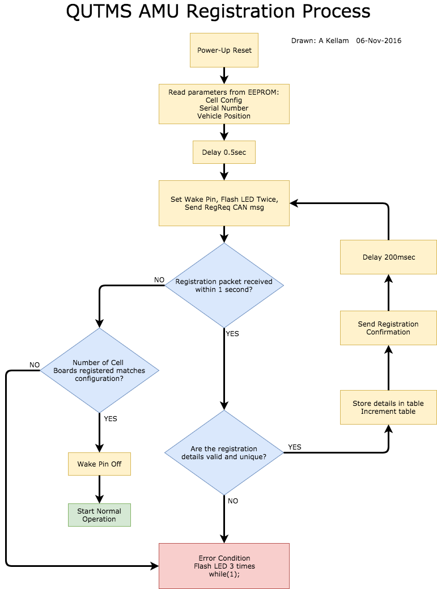
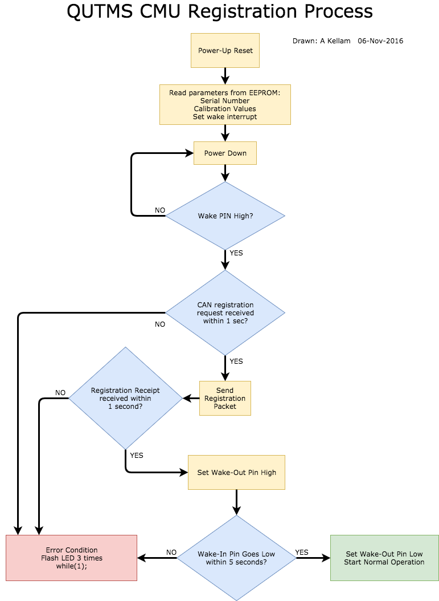

# Battery Management System Software

The software for this project is in two parts. The controller system, and the accumulator system.

## AMU - Accumulator

A rough outline of the software process

## CMU - Controller

A rough outline of the software process

